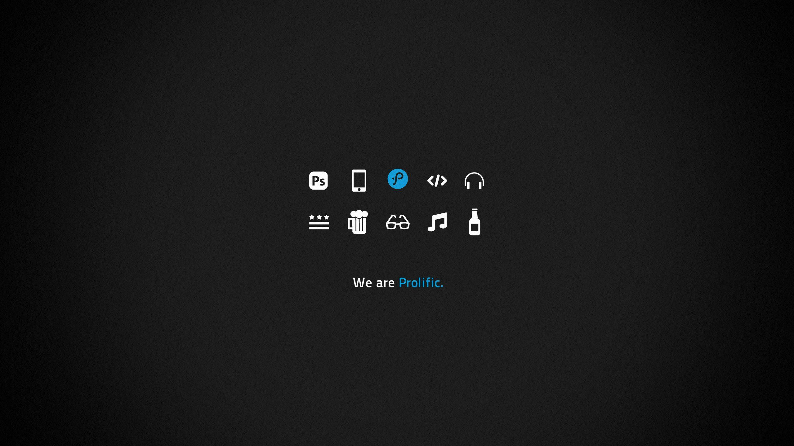

# Welcome to my GitHub! 👋

I am **Nolan Beaujault**, an engineering student at Télécom Physique Strasbourg in France. I have a huge interest in computer science, especially in its applications in healthcare.

## About Me

I am always eager to learn and improve my skills in various areas of computer science. My goal is to contribute to impactful projects, particularly in the medical field.

## Visitor Statistics

## Contact

Feel free to reach out via:

---
